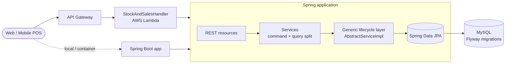

# Stock & Sales Service (POS Backend)

[](https://github.com/jumba2010/stok-and-sales-service/actions/workflows/ci.yml)


Backend for a multi-branch **Point of Sale (POS)** system used by retail shops - covering the product catalog,
suppliers, stock entries, physical inventory counts with adjustments, and sales.
It runs both as a regular Spring Boot service **and as a serverless function on AWS Lambda** behind API Gateway,
from the same codebase.

---

## Key capabilities

| Domain | Capabilities |
|--------|--------------|
| **Catalog** | Products, categories, suppliers, units and taxes; dynamic product search with JPA **Specifications** |
| **Stock** | Stock entries per supplier/warehouse, stock history by period, **FIFO stock consumption** per product with insufficient-stock protection |
| **Inventory** | Physical inventory counts, system vs. physical quantity reconciliation, adjustments with reasons |
| **Reporting** | Inventory reports exported to **PDF** (Thymeleaf + OpenHTMLtoPDF) and **Excel** (Apache POI), localized in English and Portuguese |
| **Sales** | Sales with line items, clients, promotions, cancellation |
| **Multi-branch** | Every record is scoped to a *sucursal* (branch) and carries full audit metadata |

## Architecture & design



- **Modular, package-by-feature layout** - `product`, `stock`, `sale`, `user`, each with its own `resource → service → dao → entity` slices.
- **CQRS-style service split** - write services (`ProductService`) are separated from read services (`ProductQueryService`) to keep queries free to evolve (projections, fetch joins) independently of commands.
- **Generic lifecycle layer** - `AbstractServiceImpl<T, ID>` and `LifeCycleEntity` centralize auditing (`createdBy`, `updatedBy`, `activatedBy`, timestamps) and soft-delete states (`ACTIVE`, `INACTIVE`, `DELETED`, `BANNED`) for every entity.
- **Strategy pattern for stock movements** - `StockUpdateType` with `StockPlacement` (incoming) and `StockRemoval` (outgoing, FIFO) implementations.
- **Dynamic filtering** - `ProductSpecification` / `StockSpecification` build type-safe JPA Criteria queries from optional filters.
- **Consistent error model** - `BusinessException`, `ValidationException` and `EntityNotFoundException` carry an error *code* + message and are mapped to HTTP responses by a global handler.
- **Serverless adapter** - `aws-serverless-java-container` proxies API Gateway events into the Spring MVC dispatcher, so the same controllers serve both deployment modes; the shaded JAR is the Lambda artifact.
- **Schema as code** - Flyway versioned migrations own the schema; Hibernate never auto-generates DDL.

### FIFO stock removal

When units leave stock, the oldest batches of **that product** are consumed first, so cost of goods sold reflects
the batches actually sold. The operation is transactional and validated up front:

```
Batches (oldest → newest):  [4]  [5]  [6]      remove 7
Result:                     [0]  [2]  [6]      product total 15 → 8
Requesting more than available → BusinessException("stock.insufficient"), nothing changed
```

## Tech stack

- **Java 17**, **Spring Boot 2.5** (Web MVC, Data JPA, Validation, Actuator, Thymeleaf)
- **MySQL 8** with **Flyway**
- **Apache POI** (Excel), **OpenHTMLtoPDF** (PDF), i18n message bundles
- **AWS Lambda** via `aws-serverless-java-container-springboot2`, Spring Cloud Function adapter
- **Lombok**, **JUnit 5**, **Mockito**, **AssertJ**
- **GitHub Actions** CI

## REST API overview

| Resource | Endpoints |
|----------|-----------|
| Products | `POST /products`, `PUT /products/{id}`, `DELETE /products/{id}`, `GET /products/search` |
| Categories | `GET /categories` |
| Suppliers | `POST /suppliers`, `PUT /suppliers/{id}` |
| Lookups | `/lookup` (reserved for reference data) |
| Stock | `POST /stock`, `GET /stock/{id}`, `GET /stock/history` |
| Inventory | `POST /inventory`, `PUT /inventory/{id}`, `POST /inventory/adjust`, `GET /inventory/list`, `GET /inventory/{id}`, `GET /inventory/{id}/report/pdf`, `GET /inventory/{id}/report/excel` |

## Running locally

```bash
# 1. Start MySQL
docker compose up -d

# 2. Run the service (defaults match docker-compose.yml; override with MYSQL_* env vars)
./mvnw spring-boot:run
```

| Variable | Default |
|----------|---------|
| `MYSQL_HOST` / `MYSQL_PORT` | `localhost` / `3306` |
| `MYSQL_DB_NAME` | `stock_pos` |
| `MYSQL_USER` / `MYSQL_PASSWORD` | `stock_pos` / `stock_pos` |
| `FLYWAY_ENABLED` | `true` |

### Deploying to AWS Lambda

```bash
./mvnw clean package -DskipTests
```

Upload the shaded JAR from `target/` and set the handler to `provenda.pos.backend.StockAndSalesHandler::handleRequest`.

## Testing

```bash
./mvnw test -DexcludedGroups=integration   # fast unit tests (what CI runs)
./mvnw test                                # includes the full-context test - requires MySQL running
```

## Roadmap

- [ ] Upgrade to Spring Boot 3 / Jakarta EE and SnapStart for faster Lambda cold starts
- [ ] Replace the placeholder security context with JWT authentication (Cognito)
- [ ] Testcontainers-based integration tests for repositories and migrations
- [ ] OpenAPI documentation
- [ ] Event-driven stock updates from sales (outbox pattern)

## Author

**Judiao Mbaua** - Senior Backend / Java Software Engineer
[GitHub](https://github.com/jumba2010) · [LinkedIn](https://www.linkedin.com/in/judiao-mbaua-56b39946/)
